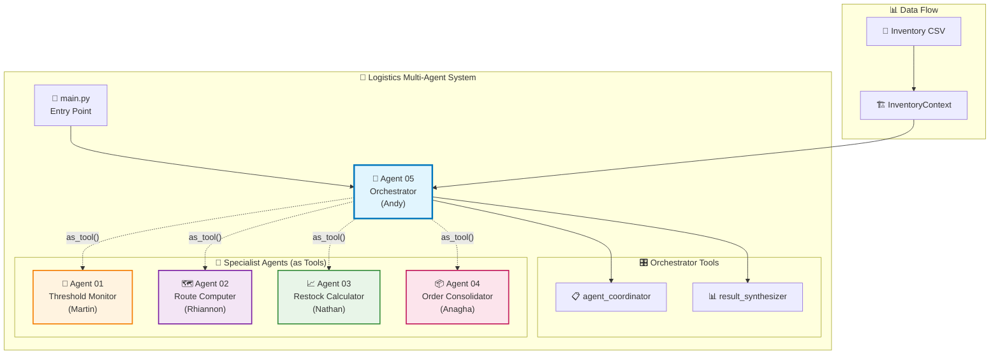
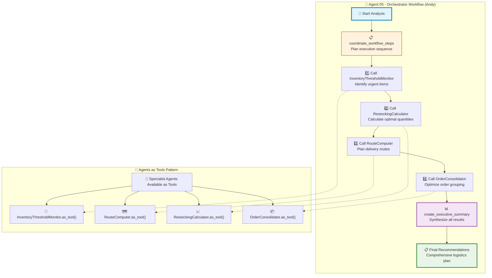
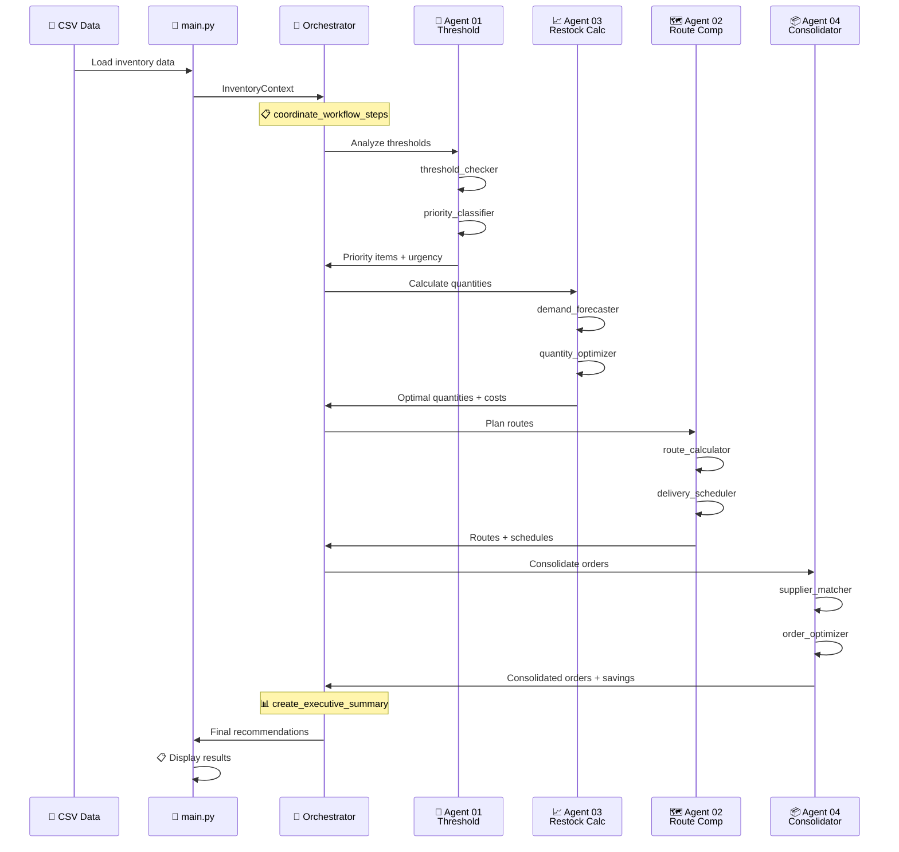

# Oxford AI Summit 2025 - Logistics Multi-Agent System

**Supply Chain Optimization using "Agents as Tools" Pattern**

## 🚀 Quick Start

**VSCode Users**: This project includes optimized VSCode settings and extension recommendations in `.vscode/`. Simply open the project in VSCode and install the recommended extensions when prompted.

First copy the `.env.example` file to a new file called `.env` in the same directory and enter your `OPENAI_API_KEY`

1. **Install & Setup**:

   ```bash
   ./install.sh
   cp .env.example .env
   # Add your OpenAI API key to .env
   ```

2. **Activate Environment** (once per session *IMPORTANT!*):

   ```bash
   source .venv/Scripts/activate  # Windows
   source .venv/bin/activate      # Mac/Linux
   ```

   **Why?** Virtual environment isolates project dependencies from your system Python.

   **Check you're in venv**: Command prompt shows `(oxford-ai-2025-group1-full-code)` prefix

   **To exit venv**: `deactivate` (when done working)

   ⚠️ **Always ensure you're in the venv before running any Python commands or tests!**

3. **Test Installation**:

   ```bash
   python -m pytest -m agent01    # Test your agent
   python run.py                  # Run full system
   ```

## 📝 Comprehensive Logging System

**All agent and tool interactions are automatically logged!**

👉 **Full Logging Guide**: [`Getting_Started/02_Logging_Guide.md`](Getting_Started/02_Logging_Guide.md)

- Complete logging configuration instructions
- Test execution with full visibility
- Log analysis and debugging commands
- Development workflow with logging

## 📚 Course Requirements & Guidelines

👉 **Read the Course Guide**: [`Getting_Started/01_Course_Guide.md`](Getting_Started/01_Course_Guide.md)

- Assignment requirements & evaluation criteria
- Step-by-step implementation approach
- Submission guidelines & deadlines

## 🔬 Development Workflow

👉 **Copy the Sample Notebook** (don't use the original!):

- **Template to copy**: [`notebooks/samples/agent01_sample_demo.ipynb`](notebooks/samples/agent01_sample_demo.ipynb)
- **Guide**: [`notebooks/samples/README_agent01_sample.md`](notebooks/samples/README_agent01_sample.md)

**Two-level development approach**:

1. **Quick testing** → Use your `tests/` folder for rapid development and small changes
2. **Document iterations** → Use your copied notebook to capture significant improvements

**Daily workflow**: Edit code → Run tests with logging → Review logs → When happy → Document in notebook

## 👥 Team Agent Assignments

| Agent | Team Member | Purpose | Location | Quick Guide |
|-------|-------------|---------|----------|-------------|
| **01** | **Martin** | Inventory Threshold Monitor | `src/logistics_agents/agents/agent_01_threshold_monitor/` | [README.md](src/logistics_agents/agents/agent_01_threshold_monitor/README.md) |
| **02** | **Rhiannon** | Route Computer | `src/logistics_agents/agents/agent_02_route_computer/` | [README.md](src/logistics_agents/agents/agent_02_route_computer/README.md) |
| **03** | **Nathan** | Restocking Calculator | `src/logistics_agents/agents/agent_03_restock_calculator/` | [README.md](src/logistics_agents/agents/agent_03_restock_calculator/README.md) |
| **04** | **Anagha** | Order Consolidator | `src/logistics_agents/agents/agent_04_order_consolidator/` | [README.md](src/logistics_agents/agents/agent_04_order_consolidator/README.md) |
| **05** | **Andy** | Orchestrator | `src/logistics_agents/agents/agent_05_orchestrator/` | [README.md](src/logistics_agents/agents/agent_05_orchestrator/README.md) |

## 📁 Project Structure

```
oxford-ai-2025-group1-full-code/
├── Getting_Started/
│   └── 01_Course_Guide.md              # Course requirements & guidelines
├── notebooks/
│   └── samples/
│       ├── agent01_sample_demo.ipynb   # Notebook template (copy this!)
│       └── README_agent01_sample.md    # Iteration workflow guide
├── logs/                               # 🆕 AUTO-GENERATED LOG FILES
│   └── logistics_agents_YYYYMMDD_HHMMSS_username.log
├── data/
│   ├── final_customer_location_aligned.csv  # Real inventory data (100+ items)
│   └── outputs/                        # Analysis results
├── src/
│   └── logistics_agents/
│       ├── main.py                     # Application entry point
│       ├── config/                     # Configuration management
│       ├── models/                     # Data models & schemas
│       ├── utils/                      # Shared utilities & data loading
│       │   ├── logging_config.py       # 🆕 ENHANCED LOGGING SYSTEM
│       │   └── agent_runner.py         # 🆕 LOGGED AGENT EXECUTION
│       └── agents/                     # Individual agent implementations
│           ├── conftest.py             # Shared test fixtures
│           ├── agent_01_threshold_monitor/     # Martin's agent
│           │   ├── agent.py            # Main agent implementation
│           │   ├── tools/              # Function tools (@function_tool)
│           │   │   ├── threshold_checker.py    # 🆕 WITH LOGGING
│           │   │   └── priority_classifier.py  # 🆕 WITH LOGGING
│           │   ├── tests/              # Unit tests
│           │   └── README.md           # Agent-specific docs
│           ├── agent_02_route_computer/        # Rhiannon's agent
│           ├── agent_03_restock_calculator/    # Nathan's agent
│           ├── agent_04_order_consolidator/    # Anagha's agent
│           └── agent_05_orchestrator/          # Andy's agent
├── install.sh                         # Setup script
├── run.py                             # Run application
└── pyproject.toml                     # Dependencies
```

## 🛠️ Development Commands

**Quick Testing with Logging** (use for rapid development):

```bash
# Basic testing with logging output
python -m pytest -m agent01 -v -s --log-cli-level=INFO
python -m pytest -m agent02 -v -s --log-cli-level=INFO
python -m pytest -m agent03 -v -s --log-cli-level=INFO
python -m pytest -m agent04 -v -s --log-cli-level=INFO
python -m pytest -m agent05 -v -s --log-cli-level=INFO

# Detailed testing with full input/output logging
python -m pytest -m agent01 -v -s --log-cli-level=DEBUG --tb=short

# All tests with logging
python -m pytest -v -s --log-cli-level=INFO
python -m pytest -m integration -v -s --log-cli-level=INFO
```

**Cost-Aware Testing** (manage OpenAI API usage):

```bash
# Run cheap tests only (skip expensive orchestration)
python -m pytest -m "agent05 and not expensive" -v -s --log-cli-level=INFO

# Run the full end-to-end orchestration test (expensive!)
python -m pytest -m "agent05 and expensive" -v -s --log-cli-level=INFO

# Run all agents except expensive tests
python -m pytest -m "not expensive" -v -s --log-cli-level=INFO
```

👉 **For detailed logging commands**: See [`Getting_Started/02_Logging_Guide.md`](Getting_Started/02_Logging_Guide.md)

**Course Documentation** (use for iteration capture):

```bash
python -m jupyterlab                # Start notebooks for iteration documentation
python run.py                       # Test full system integration (creates log file)
```

## 🎯 Your Next Steps

1. **Read the Course Guide** to understand requirements
2. **Copy the sample notebook** and rename for your agent (e.g., `agent02_rhiannon_demo.ipynb`)
3. **Work in your agent folder** (`src/logistics_agents/agents/agent_XX_*/`)
4. **Use tests for quick development** (`python -m pytest -m agentXX -v -s --log-cli-level=INFO`)
5. **Review logs** to understand agent/tool interactions (`logs/` folder)
6. **Use notebook for documented iterations** (significant improvements only)

**Remember**:

- Tests + Logs = quick development with full visibility
- Notebook = course iteration documentation
- Check `/logs/` folder after every run for detailed execution traces

## 📊 Course Pattern: "Agents as Tools"

Each specialist agent implements domain expertise and can be used as a tool by the orchestrator agent, enabling dynamic coordination based on real-time logistics conditions.

**All interactions are automatically logged for learning and debugging!**

---

**Ready to start?** → [`Getting_Started/01_Course_Guide.md`](Getting_Started/01_Course_Guide.md)

---

## 📊 System Architecture Diagrams

### Overall System Architecture - "Agents as Tools" Pattern



### Agent 05 - Orchestrator Workflow



### Data Flow Sequence


